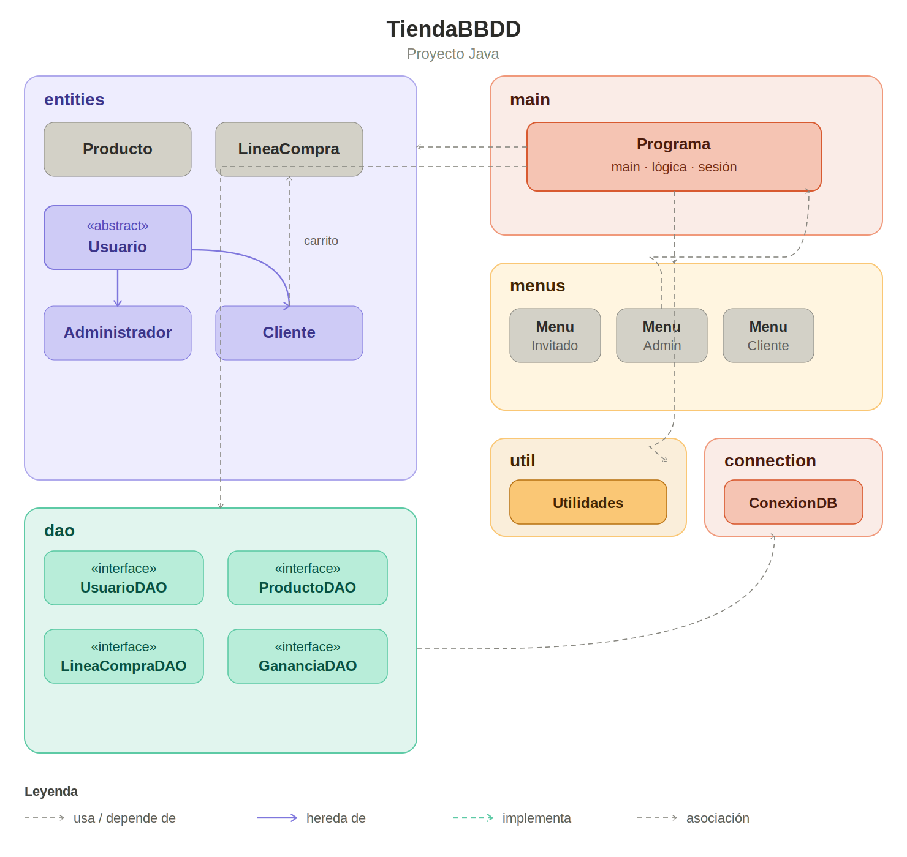

# TiendaBBDD

Aplicación de gestión de tienda en Java con persistencia en base de datos Oracle XE mediante JDBC y patrón DAO.

---

## Descripción

Ejercicio extenso de clase diseñado para repasar y consolidar múltiples conceptos del lenguaje Java y el acceso a bases de datos relacionales. Es la segunda versión del proyecto [TiendaFicheros](https://github.com/guille22aa/TiendaFicheros), sustituyendo la capa de persistencia con ficheros por una base de datos Oracle XE gestionada con JDBC.

La aplicación simula una tienda con tres tipos de usuario (invitado, cliente y administrador), gestión de productos y un carrito de compra persistente entre sesiones.

El grueso del código está desarrollado a mano. Se ha usado IA como apoyo para debug, orientación técnica, generación de los comentarios Javadoc y el diagrama de paquetes.

---

## Estructura del proyecto

```
TiendaBBDD/
├── src/
│   ├── connection/
│   │   └── ConexionDB.java          # Conexión JDBC a Oracle XE
│   ├── entities/
│   │   ├── Usuario.java             # Clase abstracta base
│   │   ├── Administrador.java
│   │   ├── Cliente.java             # Incluye carrito como List<LineaCompra>
│   │   ├── Producto.java
│   │   └── LineaCompra.java         # Fila del carrito en BBDD
│   ├── dao/
│   │   ├── UsuarioDAO.java          # Interfaz
│   │   ├── UsuarioDAOImpl.java
│   │   ├── ProductoDAO.java         # Interfaz
│   │   ├── ProductoDAOImpl.java
│   │   ├── LineaCompraDAO.java      # Interfaz
│   │   ├── LineaCompraDAOImpl.java
│   │   ├── GananciaDAO.java         # Interfaz
│   │   └── GananciaDAOImpl.java
│   ├── menus/
│   │   ├── MenuInvitado.java
│   │   ├── MenuAdministrador.java
│   │   └── MenuCliente.java
│   ├── main/
│   │   └── Programa.java            # Lógica central y punto de entrada
│   └── util/
│       └── Utilidades.java          # Lectura y validación de datos
├── doc/
│   ├── javadoc/
│   └── jerarquia_paquetes_bbdd.png
└── schema.sql                       # Script de creación de la BBDD
```

### Diagrama de paquetes y clases



---

## Conceptos trabajados

- **JDBC** — conexión a Oracle XE con `DriverManager`, uso de `PreparedStatement` y `ResultSet`, gestión de conexiones con try-with-resources y recuperación de claves generadas con `getGeneratedKeys()`.
- **Patrón DAO con interfaces** — separación clara entre la lógica de negocio y el acceso a datos. Cada entidad tiene su interfaz y su implementación independientes.
- **SQL** — DDL con creación de tablas, constraints de clave primaria, foránea y check; DML con operaciones CRUD completas incluyendo integridad referencial (no se puede eliminar un producto si hay clientes que lo tienen en el carrito).
- **POO** — herencia (`Administrador` y `Cliente` extienden la clase abstracta `Usuario`), polimorfismo en el método `mapear()` que reconstruye el tipo correcto según el campo `TIPO` de la BBDD.
- **Colecciones y genéricos** — `List<Usuario>`, `List<Producto>`, `List<LineaCompra>` como resultado de las consultas DAO.
- **Manejo de excepciones** — control de `SQLException` en todas las operaciones de acceso a datos, incluyendo detección de violaciones de integridad referencial.

---

## Requisitos

- Java 15 o superior (se usan *text blocks*)
- Oracle XE con el contenedor `XEPDB1` activo
- Driver JDBC `ojdbc11.jar` (no incluido por licencia, descargable desde [oracle.com](https://www.oracle.com/database/technologies/appdev/jdbc-downloads.html))

---

## Configuración de la base de datos

Ejecutar `schema.sql` conectado como `SYS` o `SYSTEM` al contenedor `XEPDB1`. El script crea el usuario `TIENDAJAVA`, las tablas y un administrador por defecto con credenciales `admin` / `admin123`.

---

## Documentación

[Javadoc](https://guille22aa.github.io/TiendaBBDD/doc/javadoc/index.html)

---

## Versión anterior

[TiendaFicheros](https://github.com/guille22aa/TiendaFicheros) — misma aplicación con persistencia mediante ficheros binarios y de texto en lugar de base de datos.
